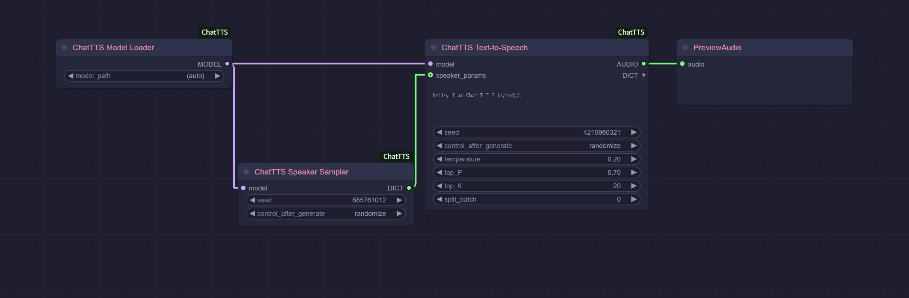

# ComfyUI-ChatTTS

A ComfyUI integration for [ChatTTS](https://github.com/2noise/ChatTTS), enabling high-quality, controllable text-to-speech generation directly in your ComfyUI workflows.

## Example Workflows

### Basic Text-to-Speech


This simple workflow demonstrates basic text-to-speech conversion:
1. Load the ChatTTS model
2. Sample a random speaker voice
3. Convert text to speech
4. Preview the audio output

<!-- ### Voice Cloning


This workflow shows how to clone a voice from a reference audio file:
1. Load the ChatTTS model
2. Load a reference audio file
3. Extract speaker characteristics
4. Convert new text using the extracted voice

[Download voice cloning workflow](examples/ChatTTS_VoiceCloning.json) -->

## Features

- **High-Quality Voice Synthesis** - Generate natural-sounding speech from text input
- **Voice Control** - Sample random speakers or customize voice characteristics
- **Parameter Adjustment** - Fine-tune temperature, top-P, top-K and other generation parameters
- **Batch Processing** - Support for batch text processing through split_batch option
- **Seamless Integration** - Works directly with ComfyUI's audio nodes

## Installation

### Prerequisites
- A working installation of ComfyUI
- Python 3.8+ with PyTorch installed

### Using ComfyUI Manager (Recommended)
1. Install [ComfyUI Manager](https://github.com/ltdrdata/ComfyUI-Manager)
2. Search for "ChatTTS" and install

### Manual Installation
1. Navigate to your ComfyUI's `custom_nodes` directory
2. Clone this repository:
   ```
   git clone https://github.com/neverbiasu/ComfyUI-ChatTTS
   ```
3. Install the requirements:
   ```
   cd ComfyUI-ChatTTS
   pip install -r requirements.txt
   ```

## Model Setup

ChatTTS models will be automatically downloaded when first used, or you can manually place them in:

```
ComfyUI/models/chattts/
```

The first time you run the `ChatTTSLoader` node, it will:
1. Check for existing models in the models/chattts directory
2. If none are found, download models from the official repository
3. Load the model for use in your workflows

## ChatTTS Control Tags

ChatTTS supports various special tags that can be inserted into your text to control the speech generation. These tags allow you to customize the speech output without changing the model parameters.

| Tag          | Range | Description                                             |
| ------------ | ----- | ------------------------------------------------------- |
| `[speed_n]`  | 1-9   | Controls speech speed (higher numbers = faster)         |
| `[oral_n]`   | 0-9   | Controls oral expressiveness style                      |
| `[laugh_n]`  | 0-2   | Controls laughter intensity                             |
| `[break_n]`  | 0-7   | Controls pause duration (higher numbers = longer pause) |
| `[uv_break]` | -     | Inserts a brief pause/break at the word level           |
| `[lbreak]`   | -     | Inserts a longer pause/break (similar to line break)    |
| `[laugh]`    | -     | Inserts laughter at the specified position              |

## Acknowledgements

- [ChatTTS](https://github.com/2noise/ChatTTS) for the core text-to-speech technology
- [ComfyUI](https://github.com/comfyanonymous/ComfyUI) for the wonderful UI framework

## License

This project is licensed under the MIT License - see the LICENSE file for details.
